<div align="center">
  

  <br/>

  <h1 align="center">
    
  </h1>

  <p align="center">
    <strong>✨ Passionate Full Stack Developer & AI Enthusiast</strong><br/>
    Building the future, one line of code at a time.
  </p>

  <p align="center">
    <a href="https://www.linkedin.com/in/deeptanu-bhunia-184426297/">
      
    </a>
    <a href="https://https://deeptanubhunia.vercel.app/">
      
    </a>
    <a href="mailto:futuristicthought07@gmail.com">
      
    </a>
  </p>
</div>

---
<div align="center">


<br/>


</div>

<br/>

---

<div align="center">

```
 ════════════════════════════════════════════════════════
      刀   When you play the game of code, you ship or you die.   刀
 ════════════════════════════════════════════════════════
```

</div>

---

## 〔 I — The Warrior's Scroll 〕

```python
class DeeptanuBhunia:
    """
    ┌─────────────────────────────────────────────────────────────┐
    │  HOUSE:    Full Stack (MERN) · Agentic AI · Real-Time Sys   │
    │  SEAT:     Newton School of Technology, ADYPU — Pune        │
    │  RANK:     SIH 2024 Grand Finalist & Runner-Up  🏆          │
    │  CREED:    Ship production-grade code or perish in review    │
    └─────────────────────────────────────────────────────────────┘
    """
    weapons      = ["TypeScript", "Python", "Node.js", "React", "Next.js"]
    strongholds  = ["MongoDB", "MySQL", "Supabase", "PostgreSQL"]
    arts         = ["Agentic AI", "LLM Orchestration", "WebSocket", "UAV Telemetry"]
    alliances    = ["Google Cloud", "Docker", "OAuth 2.0", "Prisma ORM"]
    guild        = ["RoboWars @ IIT BHU", "Iris Robotics — 70+ disciples trained"]
    obsession    = "Dark themes · Minimal UI · Systems that don't fail at 3AM"

    currently    = "⚔  Forging AI-driven SaaS — the siege never stops"
    experimenting= "🧪  Multi-Agent Systems & LLM orchestration in the shadows"
    focused_on   = "📡  Sub-100ms systems · Scalable arch · No excuses"
```

---

## 〔 II — The Arsenal 〕

<div align="center">


</div>

<br/>

<div align="center">

|  ⚡ Spells · Frontend  |  🛡 Fortress · Backend  |  🗡 Blades · Languages  |
|:---:|:---:|:---:|
| React · Next.js · Vue.js | Node.js · Express.js | TypeScript · Python · SQL |
| Tailwind CSS · Redux | MongoDB · MySQL · Supabase | C++ · HTML/CSS · Bash |
| Prisma ORM · Framer Motion | WebSocket · OAuth 2.0 | NumPy · Pandas · Git |

</div>

---

## 〔 III — Battles & Stats 〕

<div align="center">


</div>

<br/>

<div align="center">


</div>

<br/>

<div align="center">


</div>

---

## 〔 IV — Chronicles · Featured Projects 〕

<table>
<tr>
<td width="50%" valign="top">

```
╔══════════════════════════════╗
║  🐾  PAWZZ  ·  April 2026   ║
╚══════════════════════════════╝
```

A real-time coordination system uniting pet owners, vets, NGOs & volunteers — instant booking, SOS response, admin-controlled workflows. Built because chaos in pet care was the enemy.


</td>
<td width="50%" valign="top">

```
╔══════════════════════════════════════╗
║  📡  UAV TELEMETRY  ·  Nov 2025     ║
╚══════════════════════════════════════╝
```

Cross-platform desktop app — sub-100ms visualization of GPS, IMU & sensor data for UAV ops. WebSocket-driven. Node.js + MySQL for mission-critical data replay and field debugging.


</td>
</tr>
<tr>
<td width="50%" valign="top">

```
╔══════════════════════════════════════╗
║  🌾  AGRSETU  ·  July 2025          ║
╚══════════════════════════════════════╝
```

Built at Google Cloud Agentic AI Day — multilingual crop advisory AI for low-tech rural farmers. Real agentic pipeline. Real impact. Certificate earned.


</td>
<td width="50%" valign="top">

```
╔══════════════════════════════════════╗
║  🏆  SIH 2024  ·  December 2024     ║
╚══════════════════════════════════════╝
```

Smart Indian Hackathon — National Grand Finalist & Runner-Up. Ministry of Education (MoE) & AICTE. Built under fire. Shipped under pressure. No throne is given.


</td>
</tr>
</table>

---

## 〔 V — The Brotherhood · Guilds & Orders 〕

<div align="center">

```
  ⚔  ROBOWARS @ IIT BHU  ——  Team Lead · Robot design & fabrication for high-intensity combat
  ⚙  IRIS ROBOTICS  ————————  CAD Lead · Trained 70+ disciples in Fusion 360 & rapid prototyping
  🚀  PROJECT RLV  ——————————  Researcher · High-fidelity aerospace sensor integration
```

</div>

---

## 〔 VI — Codeforces & LeetCode Honor Roll 〕

<div align="center">

[](https://codeforces.com/yourprofile)
[](https://leetcode.com/yourprofile)

*The arena never sleeps. Neither do I.*

</div>

---

## 〔 VII — The Dead Men's Words 〕

<div align="center">

```
  ❝  Not today.  ❞  — Arya Stark  |  Git commit -m "not today, segfault"

  ❝  A Lannister always pays his debts.  ❞  — Tywin  |  A dev always pays his tech debt.
                                                        (They don't. But they say they will.)

  ❝  The things I do for love.  ❞  — Jaime Lannister  |  git push --force
```

</div>

---

## 〔 VIII — Find the Warrior 〕

<div align="center">

*"Whether you have a question, a project idea, or just want to talk about AI —*
*send a raven."*

<br/>

[](https://linkedin.com/in/yourprofile)
[](https://github.com/White-D-coder)
[](https://yourportfolio.com)
[](https://codeforces.com/yourprofile)
[](https://leetcode.com/yourprofile)
[](mailto:deeptanu.bhunia@adypu.edu.in)

<br/>


<br/>

```
 ════════════════════════════════════════════════════════════
         刀   Branch out. Merge greatness. Ship or die.   刀
 ════════════════════════════════════════════════════════════
```

</div>
